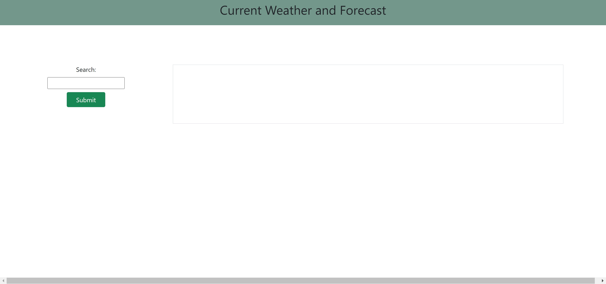
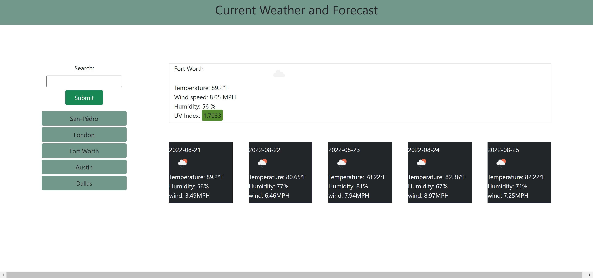

# FutureWeatherInformation

Author: Ehren Lewis

# About This Project

The motivation I had for developing this project was the need for knowing the current weather information regardless of what city it may be. Depending on how I format the API data, I can easily get only the informaiton relevant to me, instead of scouring through another app that has information I may not deem to be relevant.

I built this app to allow I and others to gain both realtime and future weather information without the overload of a typical weather application.

This application was built with HTML, CSS, Bootstrap, JavaScript, JQuery, OpenWeather API, and OpenUV API.

Throughout the development of this application, I learned about managing Ajax calls through JQuery and how to toggle only the data that I needed from the returned JSON objects. I learned how to handle errors, especially the error when I have run out of API calls for a given day. I also learned how to pass in repeated information through the chaining of Ajax and .then calls, such as the coordinates needed for multiple requests.

Known issues: OpenUV only allows for 50 API calls a day, which is a limit hit fairly easily. This causes and issue with the error handling of the last Ajax call, the alert message is specifically tuned to this error, as it seems that no other has been provided thus far, but perhaps in production this will not be the case, and this would instead be a false error.

For future versions: I would plan to style the information more professionally to allow for smoother user experience, as well as upgrading the OpenUV subscription to allow for more than just 50 calls a day. 

# How to Install

1. Navigate to the code repository
2. Press the green code button, located near the about section
3. Copy either the HTTPS, Git CLI, download the zip, open with GitHub desktop, or copy the SSH link.
4. Depending on download method, use Git, executable, or the desktop application to open the content files
5. All of the content of the repository will be available after completion of the previous state.

# OR

1. Visit the live site
2. Copy the files from the developer tools into your own files

link to repository: https://github.com/Ehren-Lewis/FutureWeatherInformation

link to live site: https://ehren-lewis.github.io/FutureWeatherInformation/

# Usage

This project is intended to be used as an educational information gathering tool to gain insight about realtime weather infoamtion nationally, as well as internationally. It is also used to gather the infromation for the next 5 days via the 5 day forecast feature. 

